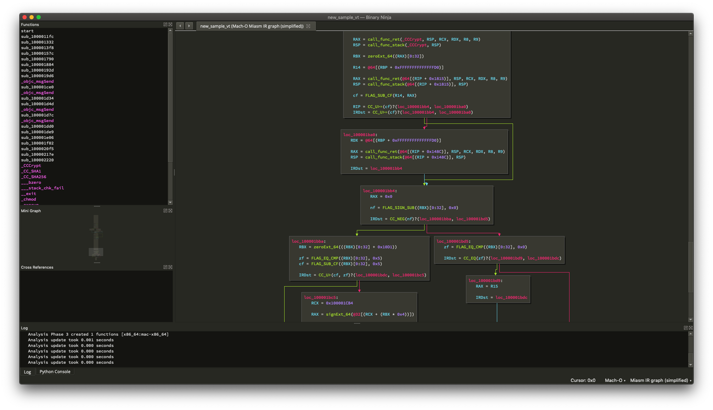
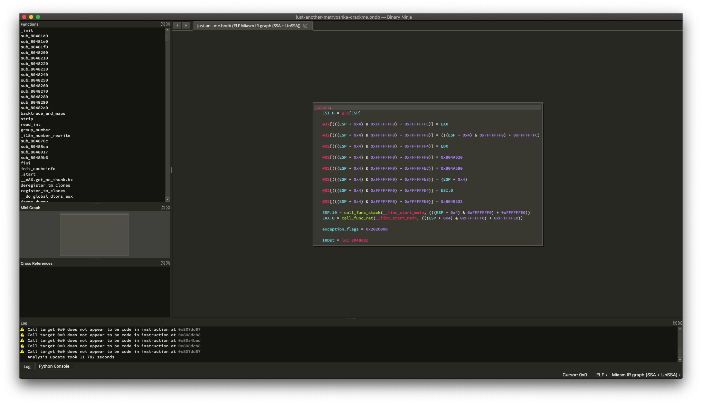

# BNMiasm 

Author: **icecr4ck**

_Visualize Miasm IR in Binary Ninja_

## Description:

Plugin to visualize Miasm IR in Binary Ninja.

Different levels of simplifications have been implemented:
* common simplifications ([IRCFGSimplifierCommon](https://github.com/cea-sec/miasm/blob/master/miasm/analysis/simplifier.py#L76) class in Miasm)
* SSA simplification (based on [IRCFGSimplifierSSA](https://github.com/cea-sec/miasm/blob/master/miasm/analysis/simplifier.py#L123))
* SSA and UnSSA passes (based on [IRCFGSimplifierSSA](https://github.com/cea-sec/miasm/blob/master/miasm/analysis/simplifier.py#L123) as well)

To use the plugin, just select which view you want to display in the View menu (View -> Miasm).

## Screenshots

## Minimum Version

This plugin requires the following minimum version of Binary Ninja:

 * release - 1.2
 * dev - 1.1.dev-1742

## Required Dependencies

The following dependencies are required for this plugin:

 * requires [miasm](https://github.com/cea-sec/miasm) to be installed.

## License

This plugin is released under a [MIT](LICENSE) license.

